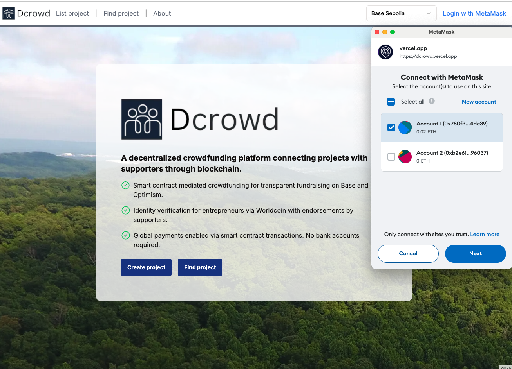
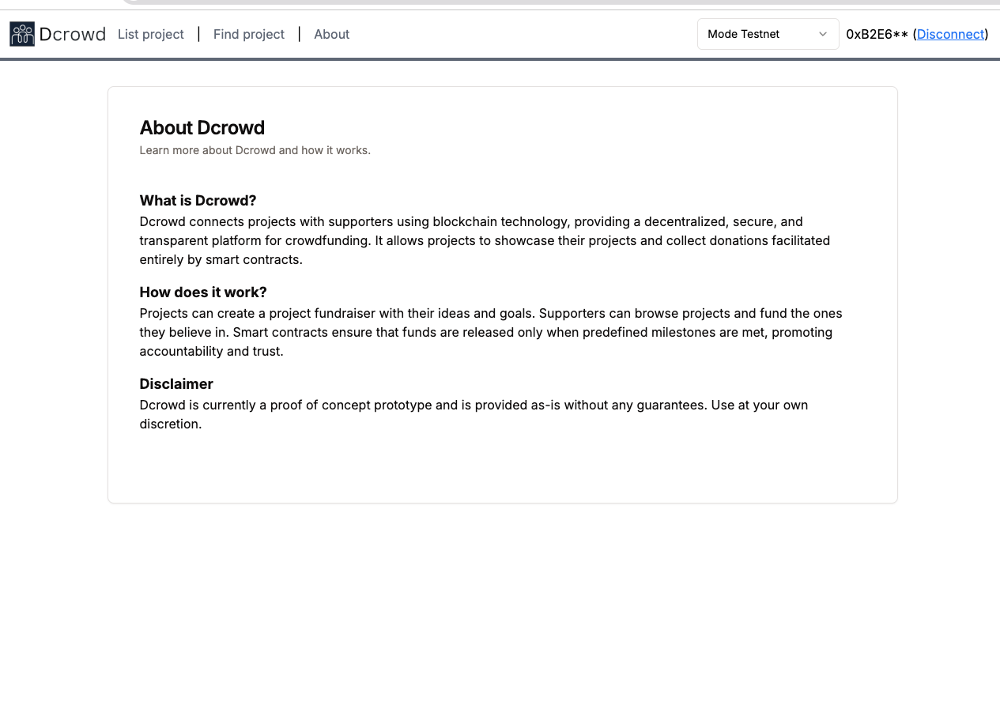
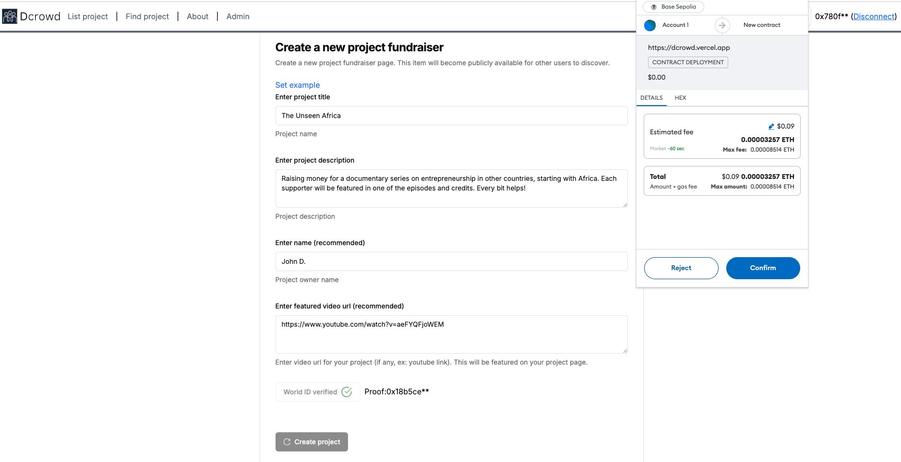
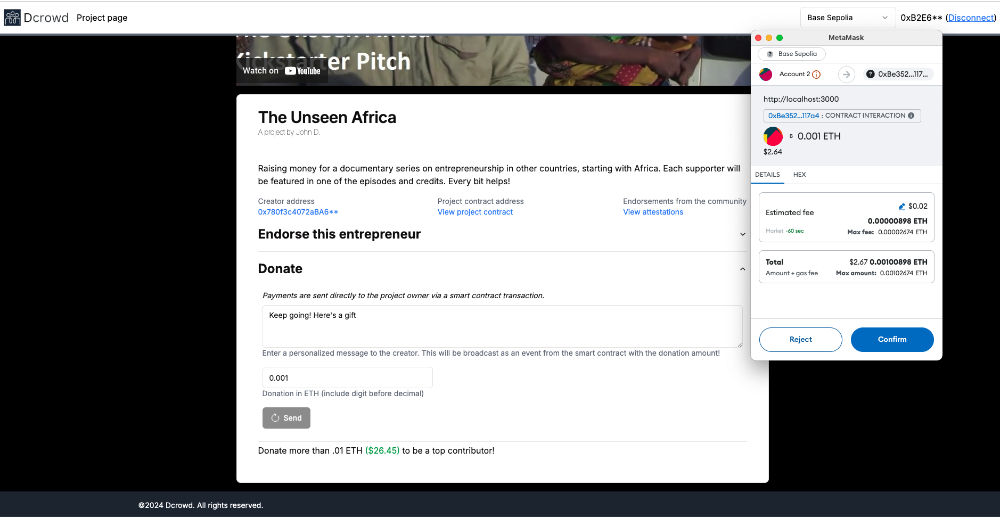

    

## Dcrowd

A smart contract mediated marketplace connecting projects with sponsors/supporters, managed by Theta blockchain technology.

Built for the <a href="https://theta2024.devpost.com/" target="_blank">Theta hackathon 2024</a>.

Live Demo URL (deployed with Theta Testnet): https://dcrowdbeta.vercel.app

Main Contract for demo above: https://testnet-explorer.thetatoken.org/address/0x13662e769FAaB0DD41890E37ABb2bD0539693D73

Demo video (YouTube ~4.5 minutes): https://youtu.be/viYsOhh_xLU

Theta portal/deployment: https://www.thetaedgecloud.com/dashboard/ai/prj_ri3cqx406ecmj96ka5ekpy277hx6/llm-detail/1/2c7dcb97ce0c4265

### Inspiration

The inspiration for Dcrowd stemmed from the challenges projects face in connecting with sponsors due to trust issues and the need for transparent transactions. Existing video platforms like Twitch and Patreon usually operate retroactively, requiring projects to produce content before receiving support. These platforms also demand significant engineering resources as well. We envisioned a solution using Theta blockchain that allows projects to build portfolio pages and collect donations via smart contracts, ensuring immediate, secure transactions and automating content request responses.

One limitation for supporters is that Patreon charges a service fee ranging from 5% to 12% of the project’s earnings, plus payment processing fees. Additionally, payouts can take several days to process. Projects are dependent on Patreon’s policies and terms of service. Changes in these policies can negatively impact projects’ income and the way they interact with their supporters. Twitch takes a significant cut of revenue from subscriptions, Bits, and ads, often leaving projects with a smaller portion of their earnings. Additionally, the platform’s high competition makes it difficult for new projects to gain visibility. Dcrowd offers a more favorable revenue model by utilizing blockchain technology, allowing projects to keep a larger share of their earnings. Smart contracts also enable a more transparent and consistent approach to moderation, reducing the risk of sudden bans or content takedowns.

### Example project pages

Project page: https://dcrowdbeta.vercel.app/project/cb-videos

Project page demo (no wallet connection required): https://dcrowdbeta.vercel.app/project/demo

Make your own page: https://dcrowdbeta.vercel.app/upload

### How it works

When a request is received, the owner of the page immediately receives the donation and an event is emitted from the smart contract with information about the request. The project is allowed to auto-generate a script for any incoming request using Theta LLMs on EdgeCloud. The handle specified is checked for existence and if it's available, creates a record on the master contract with the metadata and ledger of donations to that project.

With Dcrowd, projects can showcase their projects and connect with supporters without revealing sensitive financial information. Smart contracts ensure that transactions are securely managed, with users able to visit the page and make donations alongside specific video or content requests.

* **Projects:**
    * Post their portfolio page with their connected address to begin receiving video requests.
    * Add existing videos in a portfolio carousel featuring their latest videos.
    * Get a dedicated url per page with a unique handle that can be shared on the project's existing social media accounts without the need for new accounts.

* **Supporters:**
    * Browse through various project pages and select ones to sponsor.
    * Make a donation with a video request that gets displayed on the project page.
    * Projects can generate video scripts for their supporters' requests using the Dcrowd LLM.

When the sponsorship is completed, a blockchain event is emitted with information about the transaction. This event can be listened to on other networks, blockchain platforms, or event indexing platforms like <a href="https://thegraph.com/" target="_blank">the Graph</a>.

### Technologies used

**Theta Metachain**: This app was deployed and is live on Theta Testnet. Depending on the use case, the event fired from the contract when the listing is completed can be used to trigger separate blockchain-specific workflows. Every donation and supporter request is indexed on a smart contract that becomes preserved for other projects and platforms to search.

**Theta Gemma 2B**: Deployed LLM that can only be requested using requests from supporters. This provides an additional incentive for projects and supporters to engage on pages and make donations.

**Theta Video management API**: Projects can back up all their video content to Theta Cloud directly from the Dcrowd app when they are connected with the address associated with the project page creation.

Dcrowd is an open source project built on NextJS. Build and deploy an instance of this app yourself.

### Updating the smart contract

1. Update `ProjectContract.sol` in `/projectcontract/contracts`.

2. Install dependencies via yarn in the root folder. Run `npx hardhat compile` from `/projectcontract`.

3. Copy contents (includes ABI) to `metadata.tsx#APP_CONTRACT`.

### How to run/deploy

1. Fill in values in `.env.sample` with the exception of the contract address, copy to a new file `.env`. The contract address for the deployment will be specified in a later step.

<pre>
NEXT_PUBLIC_ADMIN_ADDRESS= // deployer address for website
NEXT_PUBLIC_CONTRACT_ADDRESS= // main smart contract deployment address
NEXT_PUBLIC_OPEN_API_KEY= // OpenAI API key for Theta LLM invocation
NEXT_PUBLIC_THETA_API_URL= // Theta API url for LLM invocation
NEXT_PUBLIC_THETA_SECRET= // Theta video API secret for content upload
NEXT_PUBLIC_THETA_KEY= // Theta video API key for content upload
</pre>

2. `yarn; yarn dev`

The app should now be running on port 3000.

3.  Go to `localhost:3000/admin`. Deploy a new instance of the `ProjectContract` - make a note of the deployed address.

4. Update the contract address from step (3) in `.env`. Restart the web server.

5. Rebuild and redeploy the project. The app should now be using the updated contract code with a new primary app contract address.

### Potential future work

1. Enhanced Smart Contract Features: Develop advanced functionalities such as milestone-based payouts, recurring subscriptions, and custom donation tiers to provide more flexible financial management options for projects.
2. Advanced Analytics and Insights: Implement comprehensive analytics tools with real-time dashboards, detailed reports, and predictive analytics to help projects make data-driven decisions.
3. Community Engagement Features: Add discussion forums, live Q&A sessions, collaborative project spaces, and gamification elements like badges and leaderboards to foster stronger community interaction.
4. Partnerships and Integrations: Forge partnerships with other platforms and services (e.g., social media, marketing tools, merchandise providers) and integrate APIs to offer projects additional resources and opportunities for monetization and promotion.
5. Localized Versions and Multilingual Support: Develop localized versions of the platform with multilingual support to cater to a global audience, making it accessible to projects and supporters from different regions and language backgrounds.

### Useful links

# Image gallery

## Home

## About page

## Creating a new project page (sponsorship page)

## Page created

## Project page

## Making a video request

## Generating a script

## Smart Contract snippet (page representation)

## Smart Contract snippet (making a request)

## LLM interaction code snippet

## Main app contract (each interaction gets added as a transaction)
https://testnet-explorer.thetatoken.org/address/0x13662e769FAaB0DD41890E37ABb2bD0539693D73

